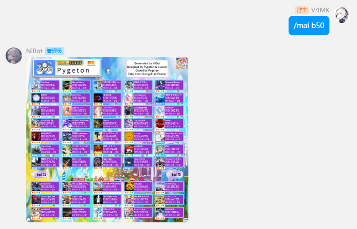
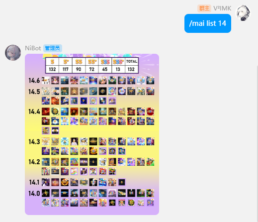
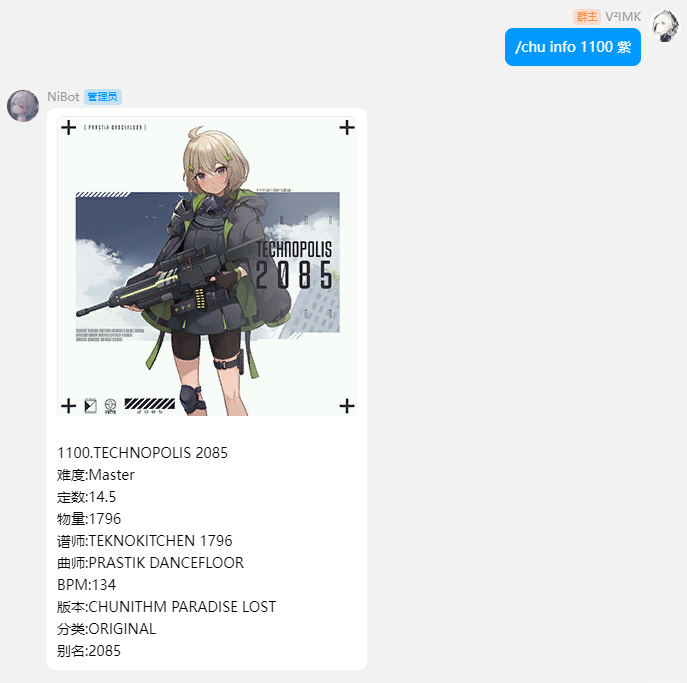
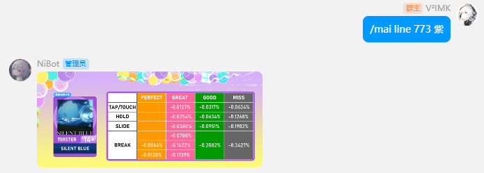
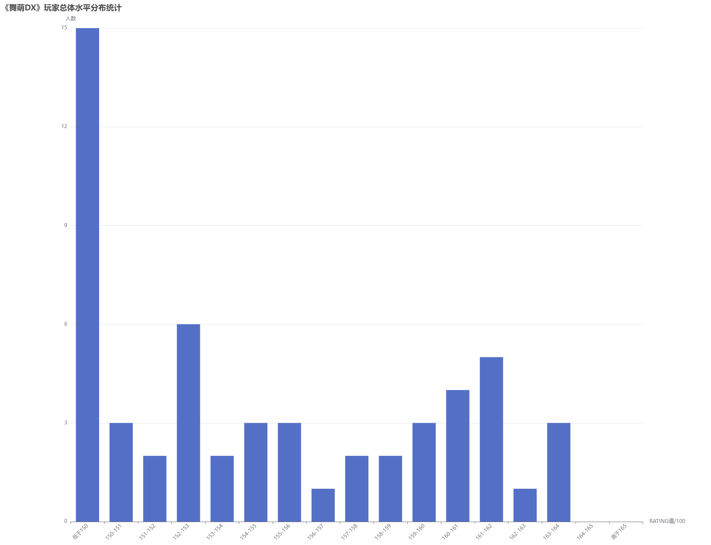
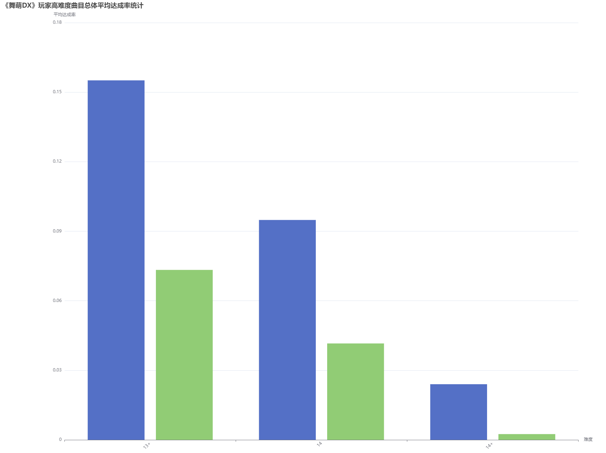

# 🎮 Online Game Player Data Analysis System

A lightweight data analysis system designed for **rhythm game players**.  
Supports **QQ bot interaction** and **web-based visualization**, enabling players to check records, analyze performance, and view community statistics.

---

## 🚀 Features
- **QQ Bot Functions (OpenShamrock)**
  - Best score analysis
  - 
  - Achievement lookup
  - 
  - Song search & chart info
  - 
  - Error margin analysis
  - 
  - Server status check
  - Admin commands (DB update, cache clear)

- **Web Dashboard (Vue + ECharts)**
  - Player rating distribution
  - 
  - High-difficulty achievement statistics
  - 

---

## 🛠 Tech Stack
**Backend:** Java, Spring Boot, MyBatis-Plus, MySQL, Selenium, Java Graphics2D  
**Frontend:** Vue 3, Element Plus, Axios, ECharts  
**Bot Framework:** OpenShamrock (WebSocket)

---

## 🧩 System Overview
- QQ bot receives commands → backend processes data → returns text/image results  
- Web dashboard fetches aggregated statistics via REST API
- Supports admin roles

---

## 📚 Background
This project is based on my undergraduate thesis:  
**“Design and Implementation of a Data Analysis System for Online Game Players”**  
South China Agricultural University, 2024
