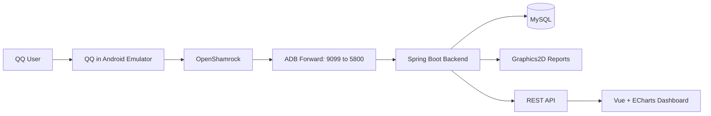

# NiBot


NiBot is a rhythm game data analysis system for **maimai DX** and **CHUNITHM** players.

It provides a QQ bot for command-based score lookup and image reports, plus a Vue dashboard for community statistics. The project was developed as my undergraduate thesis and refined as a portfolio project to demonstrate backend design, bot integration, data processing, and visualization.

## Demo

| QQ Bot: Best Score | QQ Bot: Chart Info |
| --- | --- |
|  |  |

| QQ Bot: Achievement List | Web Dashboard: Rating Distribution |
| --- | --- |
|  |  |

## Highlights

- Built a **C/S + B/S hybrid system**: QQ bot for user commands, web dashboard for statistics.
- Integrated a real QQ runtime using **Android emulator + QQ + OpenShamrock + WebSocket**.
- Implemented prioritized command routing, response callbacks, timeout handling, and reconnect logic.
- Generated game-style score cards with **Java Graphics2D**.
- Aggregated player data periodically and exposed it through REST APIs for ECharts visualization.
- Added scheduled maintenance to refresh ADB forwarding and restart QQ/OpenShamrock entry points.

## Tech Stack

| Area | Technologies |
| --- | --- |
| Backend | Java 17, Spring Boot 3.1.5 |
| Persistence | MySQL, MyBatis-Plus, JDBC |
| Bot Runtime | LDPlayer 9, Magisk, LSPosed, QQ, OpenShamrock, ADB |
| Communication | WebSocket, OneBot-compatible message format |
| Data / Image | Fastjson2, Apache POI, Selenium, Java Graphics2D |
| Frontend | Vue 3, Element Plus, Axios, ECharts |

## Architecture



## Main Features

- maimai DX: Best 50 analysis, song search, chart lookup, achievement progress, rating recommendation, chart constant table, server status.
- CHUNITHM: Best 30 analysis, song search, chart lookup, error margin analysis.
- Admin tools: song database update, cache cleanup, administrator management.
- Dashboard: rating distribution and high-difficulty achievement statistics.

## Design Decisions

**OpenShamrock over protocol-only bot frameworks**  
Older QQ bot frameworks often suffer from protocol instability and account risk. NiBot uses QQ running inside an Android emulator and OpenShamrock to receive/send messages, while the backend keeps a familiar WebSocket event model.

**Image reports for QQ interaction**  
Rhythm game score data is dense. Instead of returning long text, NiBot renders score cards and analysis tables as images so players can read and share results directly in chat.

**Separated statistics dashboard**  
Bot commands focus on individual players, while aggregated community data is served through REST APIs and visualized on the web dashboard.

## Technical Challenges

- **Runtime stability**: the emulator, ADB bridge, QQ client, and OpenShamrock can stop independently. I added reconnect logic and a scheduled rescue task to refresh ADB forwarding and restart Android activities.
- **Message filtering**: OpenShamrock sends both user messages and meta events. The backend filters heartbeat/meta events before command matching to avoid unnecessary processing.
- **Image layout**: Graphics2D does not provide interactive layout editing, so templates and coordinates were iterated with image assets and Photoshop-assisted positioning.

## Local Setup

This repository contains the backend, frontend, resources, and helper scripts. A full bot run also requires an Android emulator with QQ and OpenShamrock configured.

1. Prepare MySQL and set credentials:

```powershell
$env:DATABASE_USERNAME="your_mysql_user"
$env:DATABASE_PASSWORD="your_mysql_password"
```

2. Start the emulator-side bridge:

```bat
bat\NiBotEVM-adb-Start.bat
```

The script forwards the emulator OpenShamrock port to:

```text
ws://127.0.0.1:9099
```

3. Start the backend:

```powershell
.\mvnw.cmd spring-boot:run
```

4. Start the dashboard:

```powershell
cd web
npm install
npm run serve
```

Note: database schema and production data are not packaged in this repository yet. The screenshots and source code show the implemented behavior; full local execution requires preparing the required MySQL tables and game data.

## Background

This project is based on my undergraduate thesis:

**Design and Implementation of a Data Analysis System for Online Game Players**  
South China Agricultural University, 2024

## Disclaimer

This project is for learning, research, and portfolio demonstration purposes only. Game names, images, covers, UI resources, and related assets belong to their respective copyright holders.
